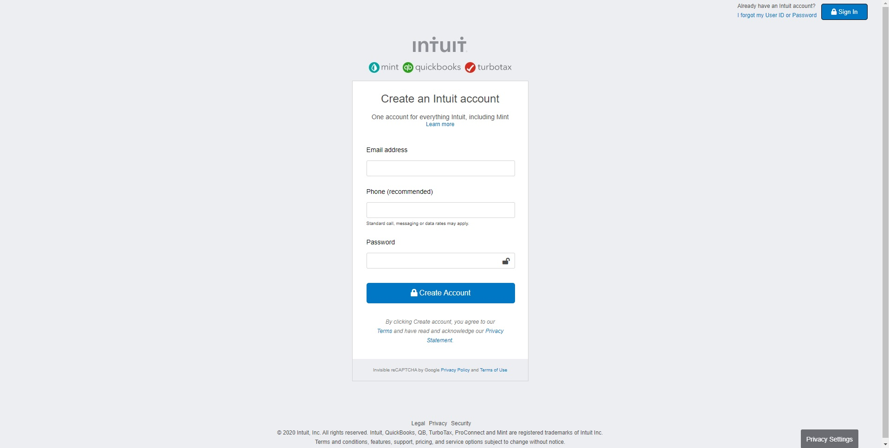

# Mint.com's signup clone page

> This project is made as part of Microverse HTML/CSS curriculum

Sample of static web page with form elements

## Built With

- HTML
- CSS/SCSS

## Getting Started

## Live Demo

[Live Demo Link](https://warblo001.github.io/MintClone/)

**See the page via the link above**

**See the Source Page via the link below**

[Source Page Link](https://accounts.intuit.com/signup.html?offering_id=Intuit.ifs.mint&namespace_id=50000026&redirect_url=https%3A%2F%2Fmint.intuit.com%2Foverview.event%3Ftask%3DS)

## Authors

👤 **Igors Oleinikovs**

- GitHub: [@github](https://github.com/Igors78)
- Twitter: [@twitter](https://twitter.com/oleinikovs)
- LinkedIn: [LinkedIn](https://www.linkedin.com/in/igors-oleinikovs-17a10958/)

👤 **Alan Solis**

- GitHub: [@github](https://github.com/warblo001)
- Twitter: [@twitter](https://twitter.com/Alan55572391)
- LinkedIn: [LinkedIn](https://www.linkedin.com/in/alan-solis-b567b044/)

## Show your support

Give a ⭐️ if you like this project!

## 📝 License

This project is [MIT](./license.txt) licensed.
